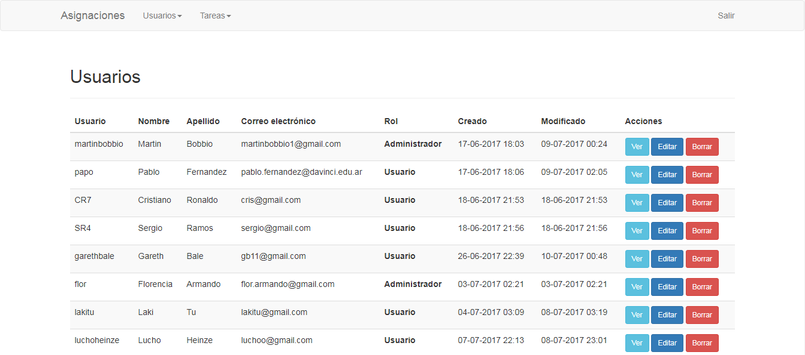
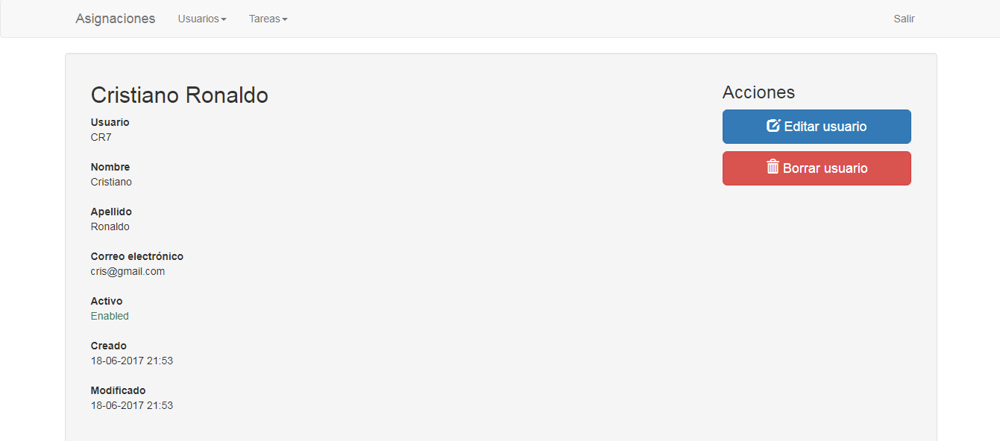
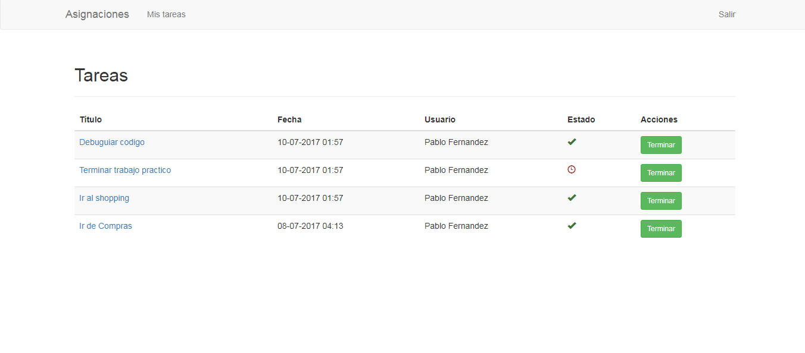

<h1 align="center">
   
  
   
  Sistema de tareas
   
</h1>

# Descripción
Sistema de tareas la cual cuenta con un backend en el cual el admin puede ver y controlar las tareas de sus usuarios ademas de poder asignar las mismas.
El sitio fue desarrollado en cloud9 y con el framework *Symfony*, su ORM *doctrine* y sus plantillas *twig*.
Los usuarios pueden ver las tareas que tienen pendientes.

Tecnologias:
- Symfony
- Doctrine
- Twig
- Bootstrap
- Ajax

# Capturas

### Inicio

### Panel

### Perfil

### Tareas

